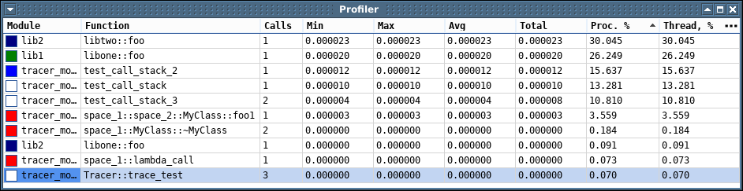

***************************
Система трассировки Trace-X
***************************

Общая информация
================

Система трассировки предоставляет возможность сбора и визуализации отладочных сообщений и данных в больших количествах.

Система состоит из передатчика - в виде подключаемой C/C++ библиотеки libtrace_x и приложения приёмника trace_x.

Библиотека libtrace_x содержит интерфейс с макросами и функциями логгирования и осуществляет передачу сообщений в приёмник.

Приложение приёмника обеспечивает сбор, отображение, интерактивную фильтрацию, поиск и анализ сообщений.

Также в состав системы входит биндинг libtrace_x для python.

Производительность системы составляет около 800 тысяч сообщений в секунду (i7-3770 CPU @ 3.40GHz).

Межпроцессное взаимодействие между передатчиком и приёмником обеспечивается с помощью локальных сокетов и разделяемой памяти.

Библиотека libtrace_x
=====================

Библиотека содержит функции и макросы для осуществления логгирования и передачи сообщений и данных.

Реализована поддержка трёх основных стилей форматирования сообщения:

1. python-форматирование - форматирование, аналогичное втроенному в python методу str.format ("{...}"). 

  Детальное описание формата приведено в разделе :doc:`Синтаксис форматирования<syntax>`.

2. C/C++ printf-форматирование ("%...").

   Описание формата доступно по ссылке (http://www.cplusplus.com/reference/cstdio/printf/).

3. iostream-форматирование - через операторы " << "

Поддержка стилей форматирования реализована с помощью встроенной библиотеки fmtlib (https://fmtlib.net).

Также реализована поддержка логирования в консоль, файлы, syslog и др. - подробнее см. в разделе "Логирование".

Макросы сообщений
-----------------

Передача всех сообщений осуществляется через макросы, снабжённые префиксом 'X_'.

Каждое сообщение снабжается следующим контекстом:
- временная метка
- идентификатор процесса
- идентификатор потока
- имя модуля
- тип сообщения
- сигнатура функции
- путь и строка файла исходного кода
- адрес объекта (если есть)
- строковая метка (если есть)

Все макросы имеют версию с постфиксом '*_F', предназначенные для использования в свободных функциях и статических методах (т.е. не имеющих указателя на this).

Ниже перечислены доступные макросы.

Макрос вызова функции
~~~~~~~~~~~~~~~~~~~~~

X_CALL - выводит сообщение о входе в функцию в месте объявления - CALL, а также при выходе из функции(её области видимости) - RETURN. 
При этом в качестве сообщения будет использовано имя функции, внутри которой объявлен макрос.

Таким образом, конструкция вида::

  void Class::method(int arg)
  {
      X_CALL;
  }

Выведет в приёмнике 2 сообщения ::

  1 | 0.018751 | module | CALL | 1_1 | Class::method
  2 | 0.018761 | module | RET  | 1_1 | Class::method

Макросы типизированных сообщений
~~~~~~~~~~~~~~~~~~~~~~~~~~~~~~~~

Группа макросов для отправки сообщений выбранного типа с одинаковым интерфейсом:

- X_INFO
- X_DEBUG
- X_WARNING
- X_ERROR
- X_EXCEPTION
- X_IMPORTANT
- X_PARAMS

Все макросы данной группы имеют версию с постфиксом '*_S', реализующие C/C++ printf механизм форматирования, например X_ERROR_S(...)

Данные макросы принимают следующие варианты аргументов:
 1. Идентификатор переменной, для которой доступно строковое представление, либо литерал.
    Пример :: X_INFO("hello world");

 2. Строку форматирования и аргументы, использующиеся при указанном форматировании. 
    Пример: X_INFO("{} {}", "hello", "world");

 3. Указатель на объект логгера trace_x::x_logger + аргументы из пунктов 1 или 2. 
    Пример: X_INFO(file_log, "{} {}", "hello", "world");
    Подробнее см. в разделе "Логирование".

 4. Ссылка на объект класса std::ostream + аргументы из пунктов 1 или 2
    Пример: X_INFO(std::cout, "{} {}", "hello", "world");

 5. Указатель на объект структуры FILE + аргументы из пунктов 1 или 2
    Пример: X_INFO(stdout, "{} {}", "hello", "world");

Также доступно ипользование оператора ввода ' << ' следующим образом:
X_INFO() << "hello " << "world";
X_INFO("hel{} ", "lo") << "world";

Специальные макросы
~~~~~~~~~~~~~~~~~~~

X_ASSERT(_condition_) - выводит сообщение типа ASSERT, если условие _condition_ не выполняется (_condition_ != true).

---

X_VALUE - макрос для отправки сообщения типа VALUE с заданной меткой для поиска. 
Имеет три перегруженные версии:

X_VALUE(<аргумент>) - отправит сообщение в виде "аргумент : строковое значение аргумента"
X_VALUE("имя аргумента", <аргумент>) - отправит сообщение в виде "имя аргумента : строковое значение аргумента"
X_VALUE("имя аргумента", "строка форматирования", ...аргументы форматирования) - отправит сообщение в виде "имя аргумента : форматированная строка"

Например ::

  QRect rect(100, 150, 190, 200);

  X_VALUE(rect) - отправит сообщение "rect : QRect(100,150 190x200)"

  X_VALUE("rect_1", rect) - отправит сообщение "rect_1 : QRect(100,150 190x200)"

  X_VALUE("rect_2", "{};{} {}x{}", rect.left(), rect.top(), rect.width(), rect.height()) - отправит сообщение "rect_2 : 100;150 190x200"
    
Макросы захвата
~~~~~~~~~~~~~~~

Данные макросы являются вспомогательными и используются для захвата аргументов.

---

X_T(arg0, arg1, ...)

Осуществляет последовательное форматирование аргументов с использованием их имён и значений:  "arg0 : {}; arg1 : {}; ..."

Таким образом, конструкция вида ::

  X_INFO(X_T(r, g, b))

выведет сообщение "r = 255; g = 120; b = 0";

---

X_CAPTURE_ARRAY(stack_array)
X_CAPTURE_ARRAY(heap_array, size)

Осуществляет форматирование массивов по указателю ::

int sarr[] = { 1, 4, 9, 16, 32 };
X_INFO("this is raw c-array: {}", X_CAPTURE_ARRAY(sarr));

int *darr = new int[darr_size];
X_INFO("this is raw c-array: {}", X_CAPTURE_ARRAY(darr, darr_size));

---

X_CAPTURE_ARG(id, index)

Осуществляет захват именованного аргумента ::

X_INFO("coordinates: {x} {y}", X_CAPTURE_ARG("x", point_1), X_CAPTURE_ARG("y", point_2))

---

X_CAPTURE_ARGS(...)

Осуществляет захват именованного аргументов, с использованием их имён ::

X_INFO("coordinates: {x}, {y}", X_CAPTURE_ARGS(x, y));

Макросы трассировки данных
~~~~~~~~~~~~~~~~~~~~~~~~~~

X_IMAGE(image)
X_IMAGE(image, "alias")
X_IMAGE(image, "alias", "format string", ...)

Где alias - метка для поиска.

Осуществляет передачу изображения 'image' и сообщения.

Объект image должен иметь перегруженный оператор вывода данных:

trace_x::image_stream &operator<<(trace_x::image_stream &os, const ImageClass &image)

Каталог trace_x/tools содержит предопределённые операторы вывода изображений:

cv_image_trace_x.h - трассировка изображений cv::Mat
qt_image_trace_x.h - трассировка изображений QImage, QPixmap версий Qt4 и Qt5.

Имя модуля источника сообщений
------------------------------

Для устаноки имени модуля необходимо определить макрос со строковым идентификатором '_TRACE_X_MODULE_NAME_' ДО момента включения заголовочного файла trace_x.h.

В противном случае будет использовано имя по умолчанию "undefined_module".

Удобно задавать его в CMakeLists.txt:
add_definitions(-D_TRACE_X_MODULE_NAME_=\"my_module\")

В файле qmake проекта .pro:
DEFINES += _TRACE_X_MODULE_NAME_=\\\"my_module\\\"

Для избежания перекрытия имён модулей следует избегать использования макросов логгирования в заголовочных файлах подключаемых библиотек.

Поддержка типов аргументов сообщений
------------------------------------

В качестве аргументов могут быть использованы следующие типы:

- все фундаментальные C++ типы(числа, строки)
- типы, имеющие определённый оператор std::ostream &operator<<(std::ostream &os, const Type &value)
- qDebug() - совместимые типы. Поддержка этих типов осуществляется с помощью модуля tools/qt_print.h
- STL контейнеры. Поддержка STL-контейнеров осуществляется с помощью встроенной библиотеки prettyprint (http://louisdx.github.io/cxx-prettyprint)
- типы, имеющие определённый оператор trace::stream &operator<<(trace::stream &os, const Type &value). 
  Этот оператор имеет наивысший приоритет над остальными, если он определён. Может быть использован в тех случаях, когда требуется специальное форматирование при наличии уже определённых операторов std::ostream &operator<< или qDebug()

Примеры использования макросов с форматированием:

Сообщение "hello world":

X_INFO("hello world");
X_INFO("hello {}", "world");
X_INFO("hello {}", QString("world"));
X_INFO("{1} {0}", "world", "hello");

std::vector<std::string> vs = {"hello ", "world"};
X_INFO(vs);

Реализована поддержка именованных аргументов:

int x = 10;
int y = 20;

X_INFO("point: ({x};{y})", X_ARGS(x, y));
X_INFO("point: ({x};{y})", X_ARG("name_1", x), X_ARG("name_2", y));

Реализована поддержка сырых("raw") массивов:

int arr[] = { 1, 4, 9, 16, 32 };
X_DEBUG("this is raw c-array: {}", X_ARRAY(arr));

double *arr = new double[10];
X_DEBUG("this is raw c-array: {}", X_ARRAY(arr, 10));

В libtrace_x также встроен перехват сообщений iostream-потоков:

- std::cout передаёт DEBUG-сообщение
- std::clog передаёт INFO-сообщение
- std::cerr передаёт ERROR-сообщение

Есть возможность подключить перехват qDebug(), qWarning(), qCritical(), qFatal() сообщений. 
Для этого нужно подключить qt_trace_handler.cpp из каталога trace_x/tools.

Логирование
-----------

В libtrace_x встроена библиотека логирования spd_log (https://github.com/gabime/spdlog).

Она позволяет создавать и использовать разноцелевые объекты логирования:

- консольный вывод с поддержкой цветов
- файлы, в том числе c настраиваемой ротацией и периодичностью
- комплексные логеры с одновременным выводом в несколько целевых объектов
- linux syslog
- WinDbg 
- собственные целевые объекты

Макросы libtrace_x поддерживают передачу объекта логгирования в качестве первого аргумента.

Пример использования ::

  trace_x::x_logger file_log = trace_x::logger::file("log.txt");

  X_INFO(file_log, "hello {}", "world");  

  trace_x::x_logger stdout_log = trace_x::logger::stdout();

  X_WARNING(stdout_log, "hello {}", "world");

  trace_x::x_logger complex_log = trace_x::logger::complex({file_log, stdout_log});

  X_ERROR(complex_log, "complex_log hello {}", "world");

Выключение процедур трассировки
-------------------------------

Все макросы отключаются путём декларирования переменной 'TRACE_X_OFF'. 
При оптимизации компилятором все процедуры трассировки будут исключены из бинарного кода.

Функции управления
------------------

Помимо макросов передачи сообщений в библиотеке реализован набор следующих функций управления приёмником:

Запуск приёмника с указанными параметрами ::

  void trace_x::start_trace_receiver(int log_mode = MODE_NO_SAVE, const char *log_dir = "", const char *server_name = 0)

log_mode - режим приёмника
log_dir - директория для сохранения трассы (по умолчанию - текущая директория)
server_name - адрес приёмника (по умолчанию - случайный - эксклюзивный для передатчика)

---

Установка адреса подключения к приёмнику (по умолчанию "trace_x")
void trace_x::trace_connect(const char *server_name)

---

Показ окна скрытого приёмника
void trace_x::show_trace_receiver()

---

Возвращает true, если приёмник с адресом `server_name` запущен
int is_server_runned(const char *server_name)

Приёмник trace_x
================

Приёмник реализован в виде приложения с графическим интерфейсом пользователя.
Также поддерживается работа в консольном режиме (флаг запуска '--no_gui').

Приёмник поддерживает сбор данных с одного или нескольких подключенных к нему передатчиков.
Приёмник имеет адрес подключения (задаётся параметром '-n', по-умолчанию "trace_x").

Приёмник имеет возможность управлять состоянием передачи - включать и выключать её в любое время.
При выключенной передаче нагрузка на передатчик минимальна и заключается в проверке  флага в разделяемой памяти на каждом сообщении.

Таблицы
-------

Фильтрация
----------

В приёмнике реализована каскадная (последовательная) трёхуровневая фильтрация:
1 уровень - фильтрация на передатчике
2 уровень - фильтрация в главной (master) таблице
3 уровень - фильтрация в подчинённой (slave) таблице.

<картинка последовательной фильтрации>

Фильтр на каждом из уровней может быть задан по следующим критериям:
- имя процесса передатчика
- имя пользователя процесса передатчика
- идентификатор процесса передатчика
- тип сообщения
- имя модуля
- идентификатор потока
- адрес объекта
- имя класса
- имя функции
- имя переменной
- имя файла с исходником
- текст сообщения

Все критерии могут быть выполнены в любой комбинации.

Фильтр имеет интерфейс настройки в виде многоуровневого дерева:
<pic>

Элементы в дереве представлены в виде групп критериев фильтрации.

Группа может быть двух типов: включающей (include) и исключающей (exclude).
Группа может состоять из набора текстовых шаблонов, которые устанавливают соответствие сообщения по соответствующему данной группе критерию.

В зависимости от типа группы фильтр либо включает указанные в группе элементы, либо исключает их из списка сообщений.

Группы могут иметь вложения других групп (с другими классами критериев). Вложение группы соответствует бинарной операции "И", т.е. сообщение будет соответствовать всему фильтру в случае соответствия фильтру каждой группы.

Группы могут располагаться на одном уровне, что соответствует бинарной операции "ИЛИ", т.е. сообщение будет соответствовать всему фильтру в случае соответствия любому фильтру из групп одного уровня.

Есть возможность создания нескольких фильтров.

Для создания нового фильтра нажмите на кнопку |new_filter|

.. |new_filter| image:: new_filter.png

Переключение текущего фильтра происходит при выборе в выпадающем списке.

Текстовое представление фильтра доступно в окне выпадающего списка фильтров.

Фильтрация на передатчике
~~~~~~~~~~~~~~~~~~~~~~~~~

Фильтр передатчика настраивается в окне "Capture Filter" :
 - Меню: Trace -> Capture Filter (F2)
 - Кнопка |capture_filter| на панели инструментов

.. |capture_filter| image:: capture_filter.png

Текущий фильтр передатчика отображается в правой части панели инструментов.

При изменении фильтра передатчика он применяется к уже принятым сообщениям.

Фильтрация в главной таблице
~~~~~~~~~~~~~~~~~~~~~~~~~~~~

Фильтр в главной таблице настраивается в выпадающем окне в правой верхней части главной таблицы:
<pic>

Фильтр главной таблицы применяется к сообщениям, отфильтрованным на передатчике.

Фильтрация в подчинённой таблице
~~~~~~~~~~~~~~~~~~~~~~~~~~~~~~~~

Фильтр в главной таблице настраивается в выпадающем окне в правой верхней части подчинённой таблицы:
<pic>

Фильтр подчинённой таблицы применяется к сообщениям, отфильтрованным в главной таблице.

Поиск
-----

Локатор
-------

Навигация
---------

Сохранение и загрузка
---------------------

Панель превью
-------------

Панель контекста
----------------

Панель структуры данных
-----------------------

Панель ошибок
-------------

Стэк вызовов
------------

Профайлер
---------

Профайлер собирает статистику по функциям, имеющим объявление макроса X_CALL:
  - Число вызовов (Calls)
  - Минимальное время выполнения (Min) 
  - Максимальное время выполнения (Max) 
  - Среднее время выполнения (Avg) 
  - Общее время выполнения (Total)
  - Процентное соотношение общего времени выполнения функции ко времени работы  программы (Proc. %)
  - Процентное соотношение общего времени выполнения функции ко времени работы  потока (Thread. %)

При наличии многопоточных вызовов функции статистика собирается по всем потокам независимо.

Статистика может быть отображена в двух вариантах:

- Исключающая (Exclusive)

  Время выполнения функции **не включает** в себя время выполнения вложенных функций. Включена по умолчанию.

- Включающая (Inclusive)

  Время выполнения функции **включает** в себя время выполнения вложенных функций.
  
Выбор варианта включения вложенных функции доступен по кнопке "..." .

Вызов окна профайлера осуществляется из меню **"Table -> Profile ... (Ctrl-P)"**.

Профайлер учитывает только те функции которые отображены в таблице с сообщениями, из которой он был вызван. Это позволяет профилировать фильтрованные сообщения.

Для того, чтобы минимизировать учёт времени на передачу сообщений внутри функции, необходимо настроить фильтр передатчика на приём только сообщений типа CALL/RETURN.

Для того, чтобы полностью исключить учёт времени на передачу сообщений внутри функции, необходимо собрать профилируемую программу с включенным флагом **TRACE_X_PROFILE**.

Просмотр исходных файлов
------------------------

Просмотр изображений
--------------------

Сессии
------

Настройки
---------

Аргументы командной строки
--------------------------

-h, --help - выводит справку по аргументам
--no_gui - запускает приёмник в консольном режиме с сохранением всей трассы по завершению
--auto_exit - запускает приёмник в режиме завершения работы при первом отключении трассируемого процесса 
-d - запускает приёмник в режиме приёма сообщений от "самого себя" (имя точки подключения - trace_x_self)
-n - задаёт имя точки подключения(по умолчанию trace_x)

Сборка
======

Для удобства сборки есть возможность опционально подключать config.cmake файл из корневой директории с исходниками.
В нём можно прописывать необходимые опции сборки - как альтернатива командной строке.

Для компиляции необходимы:
- cmake версии не ниже 2.8.11
- boost - chrono system thread atomic версии не ниже 1.53
  Доступны следующие опции линковки библиотек Boost:
  LINK_STATIC_BOOST_TO_SHARED - линковать динамическую библиотеку libtrace_x к статическим библиотекам Boost
  LINK_STATIC_BOOST_TO_ARCHIVE - линковать статическую библиотеку libtrace_x_static к статическим библиотекам Boost
  LINK_STATIC_BOOST_TO_EXEC - линковать исполняемые файлы к статическим библиотекам Boost
  
  При сборке под Windows все три опции выставлены в TRUE по умолчанию.
  Для указания пути к библиотекам Boost используются следующие переменные:
  
  set(Boost_INCLUDE_DIR C:/libs/boost_1_57_0)
  set(BOOST_LIBRARYDIR C:/libs/boost_1_57_0/lib32-msvc-12.0)
  
- Qt версии не ниже 5.3.1
- для сборки биндингов необходим swig 3 http://www.swig.org/download.html
  Для windows необходимо прописать путь к swig.exe в PATH
  Для сборки Python-биндинга необходим пакет python с заголовочными файлами(Python.h и пр.)

.. toctree::
   :maxdepth: 1
   
   Синтаксис форматирования <syntax>